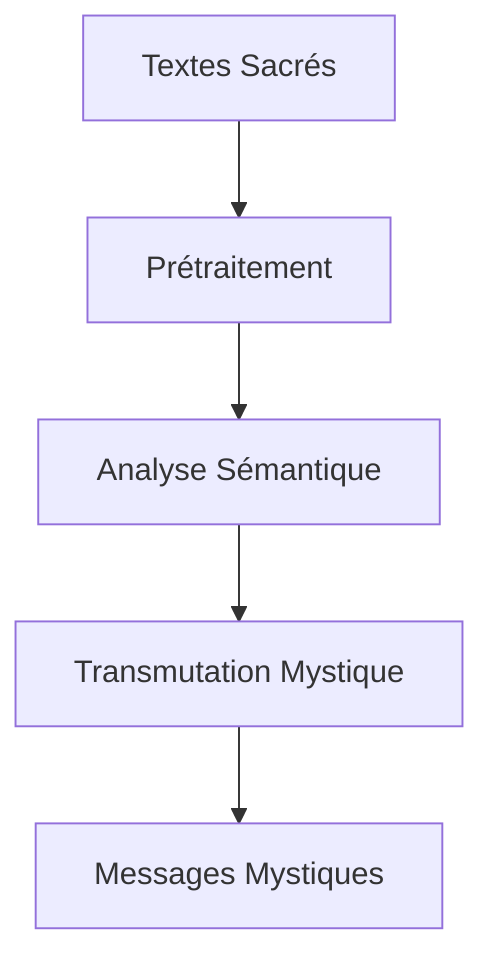
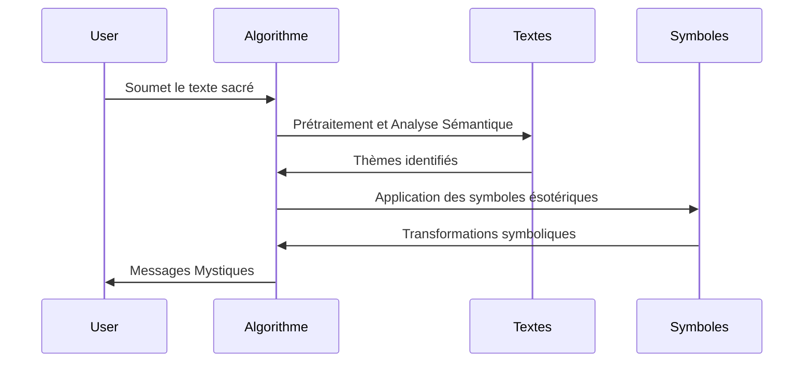

```markdown
# Exploration Algorithmique de la Vérité Subjective : Le Paradoxe de CleS

## Introduction

Le projet **paradoCleS** explore la vérité subjective à travers des algorithmes innovants appliqués à des textes sacrés et des symboles ésotériques. Cette étude vise à démontrer qu'il existe une infinité de vérités, chaque individu percevant des significations uniques et personnelles.

## Objectifs Scientifiques et Philosophiques

Notre objectif est d'explorer comment la subjectivité influence la compréhension de la vérité. Ce projet se situe à la croisée de l'épistémologie et de la théologie comparée, offrant des perspectives novatrices sur ces disciplines.

## Paradoxe de CleS

### Nature de la Vérité Subjective

La vérité subjective est un concept philosophique selon lequel la vérité dépend de la perception individuelle. Notre projet montre comment différents individus peuvent extraire des significations variées des mêmes textes sacrés.

> **Citation** : "La vérité n’est pas en soi quelque chose de constant et d’immuable. Elle est une perception personnelle et variable." - Jean-Paul Sartre

### Méthodologie

Nous utilisons des techniques avancées de traitement de texte et des symboles ésotériques pour générer des messages uniques, illustrant la diversité des vérités.

## Textes Sacrés Utilisés

Les textes sacrés intégrés dans notre étude incluent :

- La Bible
- Le Coran
- Les Upanishads
- Le Tao Te Ching

Ces textes sont choisis pour leur richesse symbolique et philosophique.

## Symboles Ésotériques

Les symboles utilisés dans notre projet enrichissent les messages générés. Par exemple :

- **Le Ouroboros** : Représente l'infinité et le cycle éternel.
- **Le Lotus** : Symbole de pureté et d'illumination spirituelle.

Ces symboles sont intégrés dans l'algorithme pour diversifier les interprétations.

## Fonctionnement de l'Algorithme

### Processus Algorithmique

Notre algorithme de traitement du langage naturel (NLP) analyse et transforme les textes sacrés en plusieurs étapes :

1. **Prétraitement** : Nettoyage et tokenisation des textes.
2. **Analyse Sémantique** : Identification des thèmes et des symboles.
3. **Transmutation Mystique** : Application des transformations symboliques.



### Formalisation Mathématique

Les transformations sont régies par des équations formelles :

$$ T(x) = S(y) \times \Phi(z) $$

où \( T \) est la transformation, \( S \) les symboles, et \( \Phi \) la fonction de transmutation.

### Exemples et Visualisation

Pour mieux comprendre les résultats, voici quelques exemples concrets de messages générés par notre algorithme à partir des textes sacrés :

| Texte Sacré      | Message Mystique                                                                 |
|------------------|----------------------------------------------------------------------------------|
| Bible            | "La lumière de l'Ouroboros éclaire le chemin de l'âme perdue."                   |
| Coran            | "Le lotus de la sagesse s'épanouit dans le cœur de celui qui cherche la vérité." |

Pour visualiser le processus, le diagramme ci-dessous illustre les étapes clés de notre algorithme :



## Conclusion

Le projet **paradoCleS** démontre que la vérité est subjective et multiple. Nous encourageons la collaboration pour approfondir cette exploration et révéler de nouvelles perspectives sur la vérité.