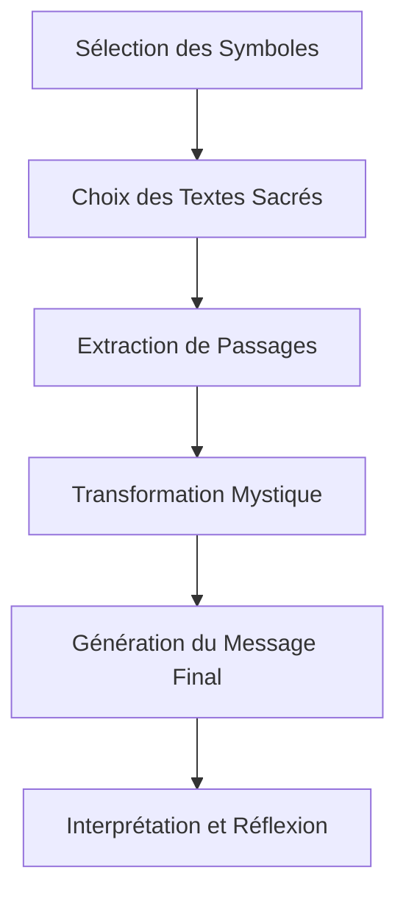

# Le Paradoxe de CleS

## 🔮 Introduction

Bienvenue dans le fascinant univers du **Projet de Transmutation Mystique**, une exploration audacieuse à la frontière de la philosophie, de la spiritualité et de la technologie. Ce projet révolutionnaire utilise des textes sacrés millénaires pour générer des messages uniques et profonds, invitant à une réflexion sur la nature même de la vérité et de la réalité.

> "La vérité est un miroir tombé de la main de Dieu et qui s'est brisé. Chacun en ramasse un fragment et dit que toute la vérité s'y trouve." - Rûmî

## 🌀 Le Paradoxe de CleS : Une Nouvelle Perspective sur la Vérité

Au cœur de notre projet se trouve le **Paradoxe de CleS**, une théorie novatrice qui remet en question notre compréhension traditionnelle de la vérité. 

### 🧠 Concept Clé

Le Paradoxe de CleS postule que la vérité n'est pas une constante universelle, mais une mosaïque complexe de perceptions individuelles, façonnée par nos expériences, nos croyances et nos contextes uniques.

### 🔍 Méthodologie Scientifique

Notre approche combine rigueur scientifique et intuition mystique :

1. **Hypothèse de la Vérité Subjective** : Nous explorons comment différentes personnes perçoivent la "vérité" face à une même question.
2. **Algorithme Mystique** : Utilisation de symboles ésotériques et de textes sacrés pour générer des messages uniques.
3. **Processus de Génération de Vérité** : Chaque exécution produit une "vérité" unique, illustrant la subjectivité de la perception.
4. **Analyse Philosophique** : Réflexion sur les implications de cette variabilité pour notre compréhension de la réalité.

## 📚 Textes Sacrés et Symboles Ésotériques

Notre algorithme puise dans un vaste corpus de textes sacrés, représentant diverses traditions spirituelles :

| Tradition       | Texte Sacré           |
|-----------------|------------------------|
| Christianisme   | 📖 Bible                |
| Islam           | 📗 Coran                |
| Hindouisme      | 📒 Bhagavad Gita, Vedas |
| Bouddhisme      | 📓 Dhammapada           |
| Taoïsme         | 📘 Tao Te Ching         |
| Zoroastrisme    | 📙 Avesta               |
| Maya            | 📕 Popol Vuh            |

### Symboles Ésotériques et Leurs Significations

| Symbole | Élément | Signification                     |
|---------|---------|-----------------------------------|
| 🜁       | Eau     | Mystère, Fluidité, Adaptation     |
| 🜂       | Feu     | Transformation, Énergie, Passion  |
| 🜃       | Terre   | Stabilité, Fondation, Matérialité |
| 🜄       | Air     | Liberté, Esprit, Intellect        |

## 🖥️ L'Algorithme de Transmutation

Notre algorithme de pointe fusionne anciennes sagesses et technologies modernes :

### Formalisation Mathématique

La transmutation est guidée par des équations sophistiquées :

$$ T(x) = S(y) \times \Phi(z) $$

Où :
- T est la transformation finale
- S représente l'influence des symboles ésotériques
- Φ est notre fonction de transmutation propriétaire

## 🌈 Exemples de Messages Mystiques Générés

Voici un aperçu des profondeurs que notre algorithme peut sonder :

> "Dans le silence de l'aube, l'âme du monde murmure les secrets de l'éternité."

> "La danse cosmique des atomes reflète la sagesse infinie de l'univers."

## 🚀 Rejoignez l'Aventure

Le Projet de Transmutation Mystique est plus qu'une simple expérience - c'est une invitation à repenser notre perception de la réalité. Nous vous invitons à :

- 🔬 Explorer le code source
- 🧘 Méditer sur les messages générés
- 🤝 Contribuer à l'évolution du projet
- 🗣️ Partager vos réflexions et expériences

## 📞 Contact

Pour toute question ou collaboration, contactez-nous à :

📧 Email : *
🌐 Site Web : *

---

*"La vérité vous libérera, mais d'abord elle vous rendra perplexe." - Anonyme*
