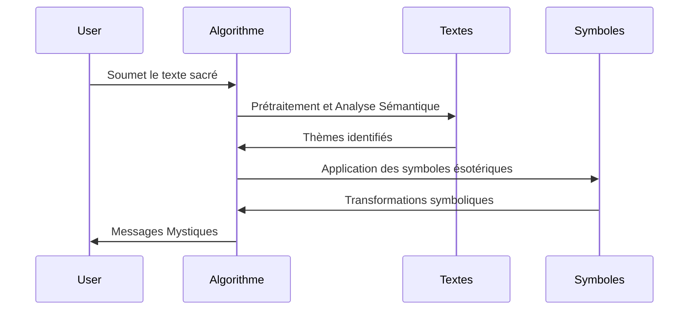

# Projet de Transmutation Mystique

## Introduction

Ce projet de transmutation mystique utilise des textes sacrés pour générer des messages uniques et mystérieux. En combinant des symboles ésotériques et des extraits aléatoires de différents textes sacrés, nous créons des messages profonds qui invitent à la réflexion. Ce projet est également conçu pour démontrer le paradoxe de la vérité subjective, appelé le Paradoxe de CleS.

## Paradoxe de CleS

Le Paradoxe de CleS explore la nature de la vérité subjective. Il part du postulat que la vérité n'est pas une constante universelle, mais une perception individuelle façonnée par les expériences, les croyances et les contextes personnels. En utilisant des symboles ésotériques et des textes sacrés, nous illustrons que la vérité peut être fluide et changeante, influencée par des choix aléatoires et des transformations mystérieuses. Chaque exécution du programme produit une vérité unique et éphémère, soulignant la complexité et la variabilité de la perception humaine.

### Description Scientifique et Méthodique du Paradoxe

1. **Hypothèse de la Vérité Subjective** :
   - La vérité est perçue différemment par chaque individu en fonction de ses croyances, expériences et contextes.
   - Une même question posée à différentes personnes engendre des réponses différentes, chaque réponse étant considérée comme une vérité absolue par l'individu qui la donne.

2. **Application de l'Algorithme Mystique** :
   - **Symboles Ésotériques** : Quatre symboles représentant des éléments fondamentaux (eau, feu, terre, air) sont utilisés pour initier le processus.
   - **Textes Sacrés** : Des extraits aléatoires de textes sacrés sont choisis pour générer des messages.
   - **Transformations Mystiques** : Les textes extraits sont transformés à travers des opérations mystérieuses (par exemple, inversion du texte, alternance de casse).

3. **Processus de Génération de la Vérité** :
   - Chaque exécution de l'algorithme produit une combinaison unique de symboles, de textes et de transformations.
   - Le message final, bien que basé sur des textes sacrés constants, est toujours différent, illustrant ainsi que la vérité générée est subjective et dépend de l'exécution spécifique du programme.

4. **Implications Philosophiques** :
   - Ce paradoxe met en lumière que la recherche de la vérité doit tenir compte de la subjectivité et de l'unicité des perspectives individuelles.
   - Il invite à la réflexion sur la nature de la réalité et la manière dont elle est perçue et interprétée.

## Textes Sacrés Utilisés

- **bible.pdf** (Christianisme)
- **coran.pdf** (Islam)
- **tao.pdf** (Taoïsme)
- **livredesmorts.pdf** (Bouddhisme Tibétain)
- **bhagavadgita.pdf** (Hindouisme)
- **dhammapada.pdf** (Bouddhisme)
- **vedas.pdf** (Hindouisme)
- **avesta.pdf** (Zoroastrisme)
- **gurugranthsahib.pdf** (Sikhisme)
- **popolvuh.pdf** (Maya)

## Symboles Ésotériques

- **🜁** : Eau (mystère, fluidité)
- **🜂** : Feu (transformation, énergie)
- **🜃** : Terre (stabilité, fondation)
- **🜄** : Air (liberté, esprit)

## Fonctionnement de l'Algorithme

### Symboles Ésotériques

Les symboles ésotériques sont utilisés pour représenter différents éléments mystiques. Chaque symbole est associé à un ou plusieurs livres sacrés.

### Livres Sacrés Associés

Chaque symbole ésotérique est associé à un ensemble de textes sacrés :

- **🜁** : `src/bible.pdf`, `src/coran.pdf`
- **🜂** : `src/rigveda.pdf`, `src/bhagavadgita.pdf`
- **🜃** : `src/avesta.pdf`, `src/popolvuh.pdf`
- **🜄** : `src/tao.pdf`, `src/bardo.pdf`, `src/dhammapada.pdf`, `src/srigourougranthsahib.pdf`

### Algorithme de Sélection Double avec Transformation

1. **Sélection des Symboles et PDF** : Le programme sélectionne deux PDF basés sur les symboles ésotériques et des règles basées sur des constantes mystiques et puissantes (comme Phi, Pi, etc.).
2. **Extraction de Textes** : Des extraits de texte aléatoires sont extraits des deux PDF sélectionnés. Une boucle assure que des pages non vides et valides sont choisies.
3. **Transformation des Textes** : Les textes extraits sont combinés et transformés en utilisant des techniques de traitement de texte avancées et mystérieuses pour créer un message final unique et profond.

### Formalisation Mathématique

Les transformations sont régies par des équations formelles :

$$ T(x) = S(y) \times \Phi(z) $$

où \( T \) est la transformation, \( S \) les symboles, et \( \Phi \) la fonction de transmutation.

### Exemples et Visualisation

Pour mieux comprendre les résultats, voici quelques exemples concrets de messages générés par notre algorithme à partir des textes sacrés :

| Texte Sacré      | Message Mystique                                                                 |
|------------------|----------------------------------------------------------------------------------|
| Bible            | "La lumière de l'Ouroboros éclaire le chemin de l'âme perdue."                   |
| Coran            | "Le lotus de la sagesse s'épanouit dans le cœur de celui qui cherche la vérité." |

Pour visualiser le processus, le diagramme ci-dessous illustre les étapes clés de notre algorithme :



```

### Exemples de Messages Mystiques

Voici quelques exemples de messages générés pour donner une idée des résultats :

- **Exemple 1** : "L'eau reflète la lumière divine, révélant les mystères cachés du cœur humain."
- **Exemple 2** : "Le feu purificateur transforme l'âme, la menant vers une nouvelle renaissance spirituelle."
- **Exemple 3** : "La terre solide offre une fondation stable pour la croissance et l'épanouissement spirituel."
- **Exemple 4** : "L'air léger et libre inspire l'esprit à explorer des hauteurs inconnues et à découvrir de nouvelles vérités."

### Schéma des Symboles et Textes Associés

| Symbole | Élément | Textes Associés                          |
|---------|---------|-----------------------------------------|
| 🜁      | Eau     | `bible.pdf`, `coran.pdf`                 |
| 🜂      | Feu     | `rigveda.pdf`, `bhagavadgita.pdf`        |
| 🜃      | Terre   | `avesta.pdf`, `popolvuh.pdf`             |
| 🜄      | Air     | `tao.pdf`, `bardo.pdf`, `dhammapada.pdf`, `srigourougranthsahib.pdf` |

## Conclusion

Le projet **paradoCleS** démontre que la vérité est subjective et multiple. Nous encourageons la collaboration pour approfondir cette exploration et révéler de nouvelles perspectives sur la vérité.